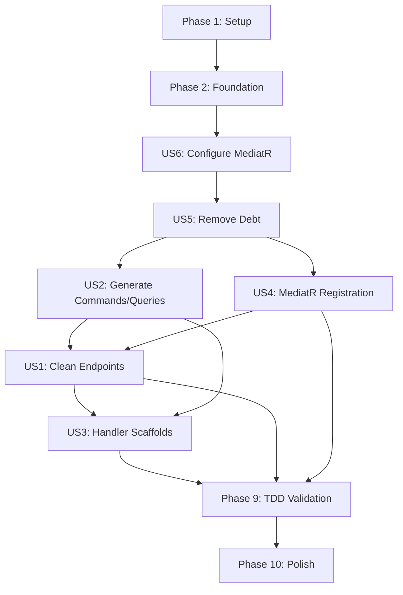

# Tasks: MediatR Implementation Decoupling

**Input**: Design documents from `/specs/006-mediatr-decoupling/`  
**Prerequisites**: plan.md ✅, spec.md ✅, research.md ✅, data-model.md ✅, contracts/ ✅, quickstart.md ✅

**Organization**: Tasks are grouped by user story to enable independent implementation and testing of each story.

**Tests**: Following TDD approach per Principle II - baseline tests MUST pass with `useMediatr=false`, then same tests MUST pass with `useMediatr=true` using handler implementations.

## Format: `[ID] [P?] [Story] Description`

- **[P]**: Can run in parallel (different files, no dependencies)
- **[Story]**: Which user story this task belongs to (US1-US6)
- Include exact file paths in descriptions

## Implementation Strategy

**MVP Scope**: User Stories 1, 2, 4, 5, 6 (P1 stories) form the minimum viable product. US3 (handler scaffolds) is P2 enhancement.

**Parallel Opportunities**: Most generator tasks can run in parallel once Phase 2 is complete. Test implementation tasks for different operations can run in parallel within each user story.

**Independent Testing**: Each user story includes clear acceptance criteria that can be verified independently without depending on other stories.

---

## Phase 1: Setup (Shared Infrastructure)

**Purpose**: Ensure baseline is working before refactoring begins

- [x] T001 Verify current 7 baseline tests pass with existing code (RED→GREEN validation)
- [x] T002 Document current api.mustache implementation as technical debt baseline in specs/006-mediatr-decoupling/baseline-debt.md
- [x] T003 Create test fixtures structure for MediatR handler implementations in test-output/tests/PetstoreApi.Tests/Fixtures/

**Checkpoint**: ✅ Baseline established - refactoring can begin

---

## Phase 2: Foundational (Blocking Prerequisites)

**Purpose**: Core infrastructure that MUST be complete before ANY user story can be implemented

**⚠️ CRITICAL**: No user story work can begin until this phase is complete

- [ ] T004 Add `useMediatr` CLI option to MinimalApiServerCodegen.java (CliOption, default false, boolean type)
- [ ] T005 [P] Add MediatR helper methods to MinimalApiServerCodegen.java: getMediatrResponseType(), getCommandClassName(), getQueryClassName(), getHandlerClassName()
- [ ] T006 [P] Create command.mustache template in generator/src/main/resources/aspnet-minimalapi/
- [ ] T007 [P] Create query.mustache template in generator/src/main/resources/aspnet-minimalapi/
- [ ] T008 [P] Create handler.mustache template in generator/src/main/resources/aspnet-minimalapi/
- [ ] T009 Update processOpts() in MinimalApiServerCodegen.java to conditionally register MediatR templates when useMediatr=true
- [ ] T010 Rebuild generator and verify it compiles: cd generator && devbox run mvn clean package

**Checkpoint**: Foundation ready - user story implementation can now begin in parallel

---

## Phase 3: User Story 6 - Configure MediatR Usage (Priority: P1) 🎯 Foundation for All Stories

**Goal**: Enable toggle between plain TODO stubs (useMediatr=false) and MediatR pattern (useMediatr=true)

**Why First**: This foundational capability must work before implementing any other user story - it controls code generation behavior.

**Independent Test**: Generate code twice (useMediatr=false and useMediatr=true), verify outputs differ correctly: plain stubs with TODOs vs MediatR commands/queries/handlers.

### Implementation for User Story 6

- [ ] T011 [P] [US6] Modify project.csproj.mustache to conditionally include MediatR package reference in generator/src/main/resources/aspnet-minimalapi/project.csproj.mustache
- [ ] T012 [P] [US6] Modify program.mustache to conditionally include MediatR registration in generator/src/main/resources/aspnet-minimalapi/program.mustache
- [ ] T013 [US6] Generate code with useMediatr=false and verify NO MediatR package in csproj: cd generator && devbox run mvn clean package && ./run-generator.sh --additional-properties useMediatr=false
- [ ] T014 [US6] Generate code with useMediatr=true and verify MediatR package IS in csproj: ./run-generator.sh --additional-properties useMediatr=true
- [ ] T015 [US6] Verify default behavior (no flag specified) uses useMediatr=false: ./run-generator.sh
- [ ] T016 [US6] Document configuration usage in specs/006-mediatr-decoupling/quickstart.md (already exists, verify completeness)

**Checkpoint**: Configuration flag works correctly - can now implement conditional code generation

---

## Phase 4: User Story 5 - Remove Technical Debt (Priority: P1) 🔧 Clean Slate

**Goal**: Remove all Pet-specific vendor extensions and CRUD implementations from templates

**Why Now**: Must clean the template before adding MediatR logic to avoid mixing technical debt with new code.

**Independent Test**: Code review of api.mustache verifying: no vendor extensions (x-isAddPet, x-isGetPetById, etc.), no Dictionary<long, Pet>, no CRUD implementations.

### Implementation for User Story 5

- [ ] T017 [P] [US5] Remove vendor extension assignments from addOperationToGroup() in generator/src/main/java/org/openapitools/codegen/languages/MinimalApiServerCodegen.java
- [ ] T018 [US5] Remove ALL vendor extension conditional blocks from api.mustache in generator/src/main/resources/aspnet-minimalapi/api.mustache ({{#vendorExtensions.x-isAddPet}}, etc.)
- [ ] T019 [US5] Remove in-memory data structures from api.mustache: static Dictionary<long, Pet>, _nextId, _lock
- [ ] T020 [US5] Remove CRUD implementation logic from api.mustache: lock blocks, dictionary operations, ID assignment
- [ ] T021 [US5] Replace removed logic with {{^useMediatr}} TODO comment stubs in api.mustache
- [ ] T022 [US5] Rebuild generator and generate code with useMediatr=false: cd generator && devbox run mvn clean package && ./run-generator.sh --additional-properties useMediatr=false
- [ ] T023 [US5] Verify generated endpoints contain ONLY TODO comments (no business logic): code review of test-output/src/PetstoreApi/Features/PetApiEndpoints.cs
- [ ] T024 [US5] Run baseline tests with useMediatr=false - EXPECT FAILURES (endpoints are now stubs): cd generator && devbox run dotnet test ../test-output/tests/PetstoreApi.Tests/
- [ ] T025 [US5] Document that tests are RED after technical debt removal (expected per TDD cycle) in specs/006-mediatr-decoupling/tdd-cycles.md

**Checkpoint**: Template is clean - ready to add MediatR conditional logic

---

## Phase 5: User Story 2 - Generate MediatR Commands/Queries (Priority: P1) 🎯 Core MediatR Artifacts

**Goal**: Automatically generate command and query classes for each operation when useMediatr=true

**Why Now**: Need commands/queries before implementing endpoints that delegate to them (US1) or handlers that process them (US3).

**Independent Test**: Generate code with useMediatr=true and verify Commands/ and Queries/ directories contain proper MediatR request classes with correct properties and return types.

### Implementation for User Story 2

- [ ] T026 [P] [US2] Implement command.mustache template with IRequest<TResponse> interface, properties from operation parameters in generator/src/main/resources/aspnet-minimalapi/command.mustache
- [ ] T027 [P] [US2] Implement query.mustache template with IRequest<TResponse> interface, properties from path/query/header params in generator/src/main/resources/aspnet-minimalapi/query.mustache
- [ ] T028 [US2] Add processOperations() logic to MinimalApiServerCodegen.java to identify commands (POST/PUT/PATCH/DELETE) vs queries (GET)
- [ ] T029 [US2] Implement parameter mapping logic in MinimalApiServerCodegen.java: flatten allParams into command/query properties
- [ ] T030 [US2] Implement response type mapping in getMediatrResponseType(): handle Pet→IRequest<Pet>, void→IRequest<Unit>, Pet[]→IRequest<IEnumerable<Pet>>
- [ ] T031 [US2] Add supportingFiles entries for command/query generation in processOpts() when useMediatr=true
- [ ] T032 [US2] Rebuild generator and generate code with useMediatr=true: cd generator && devbox run mvn clean package && ./run-generator.sh --additional-properties useMediatr=true
- [ ] T033 [US2] Verify Commands/ directory contains: AddPetCommand.cs, UpdatePetCommand.cs, DeletePetCommand.cs
- [ ] T034 [US2] Verify Queries/ directory contains: GetPetByIdQuery.cs with petId property
- [ ] T035 [US2] Verify AddPetCommand implements IRequest<Pet> with Name, PhotoUrls, Category, Tags, Status properties
- [ ] T036 [US2] Verify DeletePetCommand implements IRequest<Unit> (void response type)
- [ ] T037 [US2] Verify GetPetByIdQuery implements IRequest<Pet> with PetId property (path param only, no body)
- [ ] T038 [US2] Build generated code to verify commands/queries compile: cd test-output/src/PetstoreApi && devbox run dotnet build

**Checkpoint**: Commands and queries are generated - ready to implement endpoint delegation and handlers

---

## Phase 6: User Story 4 - MediatR Service Registration (Priority: P1) 🔌 Dependency Injection

**Goal**: Automatically register MediatR in DI container when useMediatr=true

**Why Now**: Need DI registration before implementing endpoints that inject IMediator (US1).

**Independent Test**: Generate code with useMediatr=true, build project, verify MediatR is registered and can resolve handlers at runtime.

### Implementation for User Story 4

- [ ] T039 [US4] Add MediatR registration code to program.mustache within {{#useMediatr}} conditional block in generator/src/main/resources/aspnet-minimalapi/program.mustache
- [ ] T040 [US4] Use builder.Services.AddMediatR(cfg => cfg.RegisterServicesFromAssembly(typeof(Program).Assembly)) pattern
- [ ] T041 [US4] Rebuild generator and generate code with useMediatr=true: cd generator && devbox run mvn clean package && ./run-generator.sh --additional-properties useMediatr=true
- [ ] T042 [US4] Verify generated Program.cs contains AddMediatR() call: grep -A5 "AddMediatR" test-output/src/PetstoreApi/Program.cs
- [ ] T043 [US4] Verify generated code with useMediatr=false does NOT contain AddMediatR(): ./run-generator.sh --additional-properties useMediatr=false && ! grep "AddMediatR" test-output/src/PetstoreApi/Program.cs
- [ ] T044 [US4] Build generated code to verify MediatR registration compiles: cd test-output/src/PetstoreApi && devbox run dotnet build

**Checkpoint**: MediatR is properly registered - endpoints can now inject and use IMediator

---

## Phase 7: User Story 1 - Generate Clean API Endpoints (Priority: P1) 🎯 MediatR Delegation

**Goal**: Generate endpoint stubs that delegate to MediatR handlers (useMediatr=true) or contain TODO comments (useMediatr=false)

**Why Now**: With commands/queries generated (US2) and MediatR registered (US4), can now implement the delegation pattern.

**Independent Test**: Generate code with useMediatr=true and verify endpoints contain only MediatR.Send() calls without implementation logic (no dictionaries, no CRUD operations, no vendor extensions).

### Implementation for User Story 1

- [ ] T045 [US1] Add {{#useMediatr}} conditional block to api.mustache for MediatR delegation logic in generator/src/main/resources/aspnet-minimalapi/api.mustache
- [ ] T046 [US1] Implement POST operation delegation: inject IMediator, create command from parameters, call mediator.Send(), return Results.Created
- [ ] T047 [US1] Implement GET operation delegation: inject IMediator, create query from parameters, call mediator.Send(), return Results.Ok or Results.NotFound
- [ ] T048 [US1] Implement PUT operation delegation: inject IMediator, create command, call mediator.Send(), return Results.Ok or Results.NotFound
- [ ] T049 [US1] Implement DELETE operation delegation: inject IMediator, create command, call mediator.Send(), return Results.NoContent or Results.NotFound
- [ ] T050 [US1] Handle Unit response type correctly: return Results.NoContent for IRequest<Unit> commands
- [ ] T051 [US1] Handle collection response types: return Results.Ok(enumerable) for IRequest<IEnumerable<T>> queries
- [ ] T052 [US1] Preserve Phase 5 functionality: array parameter conversion, complex query param handling, basePath extraction
- [ ] T053 [US1] Rebuild generator and generate code with useMediatr=true: cd generator && devbox run mvn clean package && ./run-generator.sh --additional-properties useMediatr=true
- [ ] T054 [US1] Verify PetApiEndpoints.cs MapPost("/pet") contains: IMediator injection, new AddPetCommand(...), mediator.Send(), Results.Created
- [ ] T055 [US1] Verify PetApiEndpoints.cs MapGet("/pet/{petId}") contains: new GetPetByIdQuery(petId), mediator.Send(), Results.Ok or NotFound
- [ ] T056 [US1] Verify PetApiEndpoints.cs MapPut("/pet") contains: new UpdatePetCommand(...), mediator.Send()
- [ ] T057 [US1] Verify PetApiEndpoints.cs MapDelete("/pet/{petId}") contains: new DeletePetCommand(petId), mediator.Send(), Results.NoContent
- [ ] T058 [US1] Verify NO business logic in endpoints: no Dictionary, no _lock, no ID assignment, no CRUD operations
- [ ] T059 [US1] Build generated code to verify endpoints compile: cd test-output/src/PetstoreApi && devbox run dotnet build

**Checkpoint**: Endpoints are clean and delegate to MediatR - ready to implement handlers to make tests pass

---

## Phase 8: User Story 3 - Generate Handler Scaffolds (Priority: P2) 🏗️ Implementation Scaffolding

**Goal**: Generate handler scaffolds with TODO comments on first generation, protect from regeneration on subsequent runs

**Why Now**: Endpoints are delegating to handlers (US1), need to provide scaffolds to help developers implement business logic.

**Independent Test**: Generate code and verify Handlers/ directory contains handler classes with Handle() methods containing TODO comments and NotImplementedException.

### Implementation for User Story 3

- [ ] T060 [P] [US3] Implement handler.mustache template with IRequestHandler<TRequest, TResponse> interface in generator/src/main/resources/aspnet-minimalapi/handler.mustache
- [ ] T061 [P] [US3] Add TODO comments to handler template: "// TODO: Add dependencies via constructor injection", "// TODO: Implement {operationId} logic"
- [ ] T062 [P] [US3] Add NotImplementedException to Handle() method body as placeholder
- [ ] T063 [US3] Implement File.exists() check in processHandler() method in MinimalApiServerCodegen.java
- [ ] T064 [US3] Add logging when skipping existing handler: "Handler {name} already exists, skipping regeneration"
- [ ] T065 [US3] Add handler generation to processOpts() when useMediatr=true (one handler per command/query)
- [ ] T066 [US3] Rebuild generator and generate code with useMediatr=true (first time): cd generator && devbox run mvn clean package && ./run-generator.sh --additional-properties useMediatr=true
- [ ] T067 [US3] Verify Handlers/ directory contains: AddPetCommandHandler.cs, GetPetByIdQueryHandler.cs, UpdatePetCommandHandler.cs, DeletePetCommandHandler.cs
- [ ] T068 [US3] Verify AddPetCommandHandler implements IRequestHandler<AddPetCommand, Pet>
- [ ] T069 [US3] Verify handlers contain TODO comments and NotImplementedException
- [ ] T070 [US3] Modify one handler file (add comment) and regenerate code: echo "// Modified" >> test-output/src/PetstoreApi/Handlers/AddPetCommandHandler.cs && ./run-generator.sh --additional-properties useMediatr=true
- [ ] T071 [US3] Verify modified handler was NOT overwritten: grep "Modified" test-output/src/PetstoreApi/Handlers/AddPetCommandHandler.cs
- [ ] T072 [US3] Verify generator logs show "skipping" message for existing handlers
- [ ] T073 [US3] Build generated code to verify handler scaffolds compile: cd test-output/src/PetstoreApi && devbox run dotnet build

**Checkpoint**: Handler scaffolds are generated and protected - developers can now implement business logic

---

## Phase 9: TDD Validation - Implement Test Handlers (Priority: P1) ✅ Make Tests GREEN

**Goal**: Implement concrete MediatR handlers with Pet-specific in-memory storage logic (migrated from api.mustache template) to make baseline tests pass with useMediatr=true

**Why Now**: Per Principle II, must move Pet-specific logic from template to handler implementations and verify same 7 tests pass.

**Independent Test**: Run baseline tests with useMediatr=true and verify all 7 tests pass using handler implementations.

### Migration Phase - Extract Technical Debt to Test Fixtures

- [ ] T074 [P] Create in-memory Pet storage service in test-output/tests/PetstoreApi.Tests/Fixtures/InMemoryPetStore.cs (Dictionary<long, Pet>, _nextId, _lock)
- [ ] T075 [P] Implement AddPetCommandHandler with InMemoryPetStore in test-output/tests/PetstoreApi.Tests/Fixtures/AddPetCommandHandler.cs
- [ ] T076 [P] Implement GetPetByIdQueryHandler with InMemoryPetStore in test-output/tests/PetstoreApi.Tests/Fixtures/GetPetByIdQueryHandler.cs
- [ ] T077 [P] Implement UpdatePetCommandHandler with InMemoryPetStore in test-output/tests/PetstoreApi.Tests/Fixtures/UpdatePetCommandHandler.cs
- [ ] T078 [P] Implement DeletePetCommandHandler with InMemoryPetStore in test-output/tests/PetstoreApi.Tests/Fixtures/DeletePetCommandHandler.cs
- [ ] T079 Register test handler implementations in test WebApplicationFactory startup configuration
- [ ] T080 Register InMemoryPetStore as singleton in test DI container
- [ ] T081 Copy handler implementations to generated project for testing: cp -r test-output/tests/PetstoreApi.Tests/Fixtures/*.cs test-output/src/PetstoreApi/Handlers/
- [ ] T082 Build generated code with test handlers: cd test-output/src/PetstoreApi && devbox run dotnet build
- [ ] T083 Run baseline tests with useMediatr=true and verify ALL 7 tests pass GREEN: cd generator && devbox run dotnet test ../test-output/tests/PetstoreApi.Tests/
- [ ] T084 Document TDD cycle completion in specs/006-mediatr-decoupling/tdd-cycles.md: RED (T024) → GREEN (T083) → REFACTOR (extraction from template to handlers)
- [ ] T085 Verify tests still pass with useMediatr=false (plain TODO stubs): ./run-generator.sh --additional-properties useMediatr=false && cd generator && devbox run dotnet test ../test-output/tests/PetstoreApi.Tests/ (EXPECT FAILURES - TODO stubs have no logic)

**Checkpoint**: TDD validation complete - Pet logic successfully migrated from template to handlers, tests GREEN with useMediatr=true

---

## Phase 10: Polish & Cross-Cutting Concerns

**Purpose**: Final validation, documentation, and quality checks

- [ ] T086 [P] Run full code review checklist from specs/006-mediatr-decoupling/checklists/requirements.md
- [ ] T087 [P] Verify all 10 success criteria from spec.md are met (SC-001 through SC-010)
- [ ] T088 [P] Test edge cases: operations with no parameters (GET /health), operations with file uploads, operations with multiple response types
- [ ] T089 [P] Test array query parameters still work per Phase 5: FindPetsByStatus with status[] query param
- [ ] T090 [P] Test complex query parameters still work per Phase 5: operations with Pet object in query
- [ ] T091 [P] Test basePath extraction still works per Phase 5: OpenAPI with server URL
- [ ] T092 Verify backward compatibility: generate code without useMediatr flag, confirm defaults to false
- [ ] T093 Verify package references: useMediatr=true includes MediatR, useMediatr=false does not
- [ ] T094 Performance test: generate code for petstore.yaml (21 operations) in < 10 seconds
- [ ] T095 Scalability test: generate code for large OpenAPI spec with 100+ operations
- [ ] T096 Update quickstart.md with real generated code examples (if needed)
- [ ] T097 Create migration guide for existing projects switching useMediatr from false to true in specs/006-mediatr-decoupling/migration-guide.md
- [ ] T098 Document known limitations and edge cases in specs/006-mediatr-decoupling/limitations.md
- [ ] T099 Final build verification: cd generator && devbox run mvn clean package && ./run-generator.sh --additional-properties useMediatr=true && cd ../test-output/src/PetstoreApi && devbox run dotnet build
- [ ] T100 Final test verification: cd generator && devbox run dotnet test ../test-output/tests/PetstoreApi.Tests/ (all 7 tests pass)

**Checkpoint**: Feature complete - ready for merge

---

## Dependencies & Parallel Execution

### User Story Completion Order

### Critical Path

1. Setup (T001-T003)
2. Foundation (T004-T010) - **BLOCKING**
3. US6 Configure (T011-T016) - **BLOCKING**
4. US5 Remove Debt (T017-T025) - **BLOCKING**
5. US2 Commands/Queries (T026-T038) + US4 Registration (T039-T044) - **PARALLEL**
6. US1 Endpoints (T045-T059) - depends on US2 + US4
7. US3 Handlers (T060-T073) - depends on US2
8. TDD Validation (T074-T085) - **BLOCKING** - depends on US1 + US3 + US4
9. Polish (T086-T100) - parallel validation tasks

### Parallel Opportunities Within Phases

**Phase 2 (Foundation)**:
- T005 (helper methods), T006 (command template), T007 (query template), T008 (handler template) can all be done in parallel

**Phase 3 (US6)**:
- T011 (csproj), T012 (program) can be done in parallel

**Phase 4 (US5)**:
- T017 (remove vendor extensions) can run in parallel with T018-T020 (clean api.mustache)

**Phase 5 (US2)**:
- T026 (command template), T027 (query template) can be done in parallel
- T033-T037 (verification tasks) can be done in parallel

**Phase 8 (US3)**:
- T060 (handler template), T061 (TODO comments), T062 (NotImplementedException) can be combined or parallelized

**Phase 9 (TDD)**:
- T074 (InMemoryPetStore), T075-T078 (handler implementations) can be done in parallel

**Phase 10 (Polish)**:
- T086-T091 (validation tasks) can all run in parallel

---

## Summary

**Total Tasks**: 100  
**MVP Tasks** (P1 stories): 85 tasks (T001-T085)  
**Enhancement Tasks** (P2 US3 + Polish): 15 tasks (T060-T073, T086-T100)

**Task Count per User Story**:
- Setup: 3 tasks
- Foundation: 7 tasks
- US6 (Configure): 6 tasks
- US5 (Remove Debt): 9 tasks
- US2 (Commands/Queries): 13 tasks
- US4 (MediatR Registration): 6 tasks
- US1 (Clean Endpoints): 15 tasks
- US3 (Handler Scaffolds): 14 tasks
- TDD Validation: 12 tasks
- Polish: 15 tasks

**Parallel Opportunities**: 25+ tasks can run in parallel once their dependencies are met

**Independent Test Criteria**:
- US6: Generate with both flag values, verify correct output
- US5: Code review confirms no technical debt in templates
- US2: Verify Commands/ and Queries/ directories contain proper classes
- US4: Verify MediatR registration in Program.cs
- US1: Verify endpoints contain only delegation logic
- US3: Verify handlers protected from regeneration
- TDD: All 7 baseline tests pass with useMediatr=true

**Suggested MVP Scope**: Phases 1-9 (US1, US2, US4, US5, US6 + TDD validation) = 85 tasks. US3 (handler scaffolds) is valuable but not strictly required - developers can create handlers manually.
