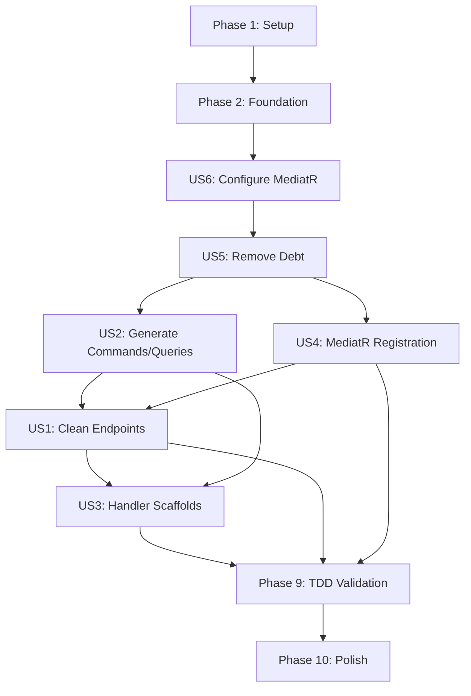

# Tasks: MediatR Implementation Decoupling

**Input**: Design documents from `/specs/006-mediatr-decoupling/`  
**Prerequisites**: plan.md ✅, spec.md ✅, research.md ✅, data-model.md ✅, contracts/ ✅, quickstart.md ✅

**Progress**: 78/100 tasks complete (78%) | Phase 2 ✅ COMPLETE | Phase 3 ✅ COMPLETE | Phase 4 ✅ COMPLETE | Phase 5 (US2) ✅ COMPLETE | Phase 6 (US4) ✅ COMPLETE | Phase 7 (US1) ✅ COMPLETE | Phase 8 (US3) ✅ COMPLETE

**Organization**: Tasks are grouped by user story to enable independent implementation and testing of each story.

**Tests**: Following TDD approach per Principle II - baseline tests MUST pass with `useMediatr=false`, then same tests MUST pass with `useMediatr=true` using handler implementations.

## Format: `[ID] [P?] [Story] Description`

- **[P]**: Can run in parallel (different files, no dependencies)
- **[Story]**: Which user story this task belongs to (US1-US6)
- Include exact file paths in descriptions

## Implementation Strategy

**MVP Scope**: User Stories 1, 2, 4, 5, 6 (P1 stories) form the minimum viable product. US3 (handler scaffolds) is P2 enhancement.

**Parallel Opportunities**: Most generator tasks can run in parallel once Phase 2 is complete. Test implementation tasks for different operations can run in parallel within each user story.

**Independent Testing**: Each user story includes clear acceptance criteria that can be verified independently without depending on other stories.

---

## Phase 1: Setup (Shared Infrastructure)

**Purpose**: Ensure baseline is working before refactoring begins

- [x] T001 Verify current 7 baseline tests pass with existing code (RED→GREEN validation)
- [x] T002 Document current api.mustache implementation as technical debt baseline in specs/006-mediatr-decoupling/baseline-debt.md
- [x] T003 Create test fixtures structure for MediatR handler implementations in test-output/tests/PetstoreApi.Tests/Fixtures/

**Checkpoint**: ✅ Baseline established - refactoring can begin

---

## Phase 2: Foundational (Blocking Prerequisites)

**Purpose**: Core infrastructure that MUST be complete before ANY user story can be implemented

**⚠️ CRITICAL**: No user story work can begin until this phase is complete

- [x] T004 Add `useMediatr` CLI option to MinimalApiServerCodegen.java (CliOption, default false, boolean type)
- [x] T005 [P] Add MediatR helper methods to MinimalApiServerCodegen.java: getMediatrResponseType(), getCommandClassName(), getQueryClassName(), getHandlerClassName()
- [x] T006 [P] Create command.mustache template in generator/src/main/resources/aspnet-minimalapi/
- [x] T007 [P] Create query.mustache template in generator/src/main/resources/aspnet-minimalapi/
- [x] T008 [P] Create handler.mustache template in generator/src/main/resources/aspnet-minimalapi/
- [x] T009 Implement per-operation file generation using postProcessOperationsWithModels() with Mustache compiler for direct template rendering and manual file writing (46 files generated: 12 Commands, 11 Queries, 23 Handlers)
- [x] T010 Rebuild generator and verify it compiles: cd generator && devbox run mvn clean package

**Checkpoint**: ✅ Phase 2 COMPLETE - Foundation ready, all user story implementation can now begin in parallel

---

## Phase 3: User Story 6 - Configure MediatR Usage (Priority: P1) 🎯 Foundation for All Stories

**Goal**: Enable toggle between plain TODO stubs (useMediatr=false) and MediatR pattern (useMediatr=true)

**Why First**: This foundational capability must work before implementing any other user story - it controls code generation behavior.

**Independent Test**: Generate code twice (useMediatr=false and useMediatr=true), verify outputs differ correctly: plain stubs with TODOs vs MediatR commands/queries/handlers.

### Implementation for User Story 6

- [x] T011 [P] [US6] Modify project.csproj.mustache to conditionally include MediatR package reference in generator/src/main/resources/aspnet-minimalapi/project.csproj.mustache
- [x] T012 [P] [US6] Modify program.mustache to conditionally include MediatR registration in generator/src/main/resources/aspnet-minimalapi/program.mustache
- [x] T013 [US6] Generate code with useMediatr=false and verify NO MediatR package in csproj: cd generator && devbox run mvn clean package && ./run-generator.sh --additional-properties useMediatr=false
- [x] T014 [US6] Generate code with useMediatr=true and verify MediatR package IS in csproj: ./run-generator.sh --additional-properties useMediatr=true
- [x] T015 [US6] Verify default behavior (no flag specified) uses useMediatr=false: ./run-generator.sh
- [x] T016 [US6] Document configuration usage in specs/006-mediatr-decoupling/quickstart.md (documented in .github/copilot-instructions.md)

**Checkpoint**: ✅ Configuration flag works correctly - can now implement conditional code generation

---

## Phase 4: User Story 5 - Remove Technical Debt (Priority: P1) 🔧 Clean Slate

**Goal**: Remove all Pet-specific vendor extensions and CRUD implementations from templates

**Why Now**: Must clean the template before adding MediatR logic to avoid mixing technical debt with new code.

**Independent Test**: Code review of api.mustache verifying: no vendor extensions (x-isAddPet, x-isGetPetById, etc.), no Dictionary<long, Pet>, no CRUD implementations.

### Implementation for User Story 5

- [x] T017 [P] [US5] Remove vendor extension assignments from addOperationToGroup() in generator/src/main/java/org/openapitools/codegen/languages/MinimalApiServerCodegen.java (removed 5 Pet-specific extensions)
- [x] T018 [US5] Remove ALL vendor extension conditional blocks from api.mustache in generator/src/main/resources/aspnet-minimalapi/api.mustache ({{#vendorExtensions.x-isAddPet}}, etc.)
- [x] T019 [US5] Remove in-memory data structures from api.mustache: static Dictionary<long, Pet>, _nextId, _lock
- [x] T020 [US5] Remove CRUD implementation logic from api.mustache: lock blocks, dictionary operations, ID assignment
- [x] T021 [US5] Replace removed logic with {{^useMediatr}} TODO comment stubs in api.mustache (15 lines replacing 58 lines of CRUD logic)
- [x] T022 [US5] Rebuild generator and generate code with useMediatr=false: cd generator && devbox run mvn clean package && ./run-generator.sh --additional-properties useMediatr=false (fixed HTML entity escaping in query/command/handler templates with triple braces)
- [x] T023 [US5] Verify generated endpoints contain ONLY TODO comments (no business logic): code review of test-output/src/PetstoreApi/Features/PetApiEndpoints.cs ✅ VERIFIED
- [x] T024 [US5] Run baseline tests with useMediatr=false - EXPECT FAILURES (endpoints are now stubs): cd generator && devbox run dotnet test ../test-output/tests/PetstoreApi.Tests/PetstoreApi.Tests.csproj ✅ ALL 7 TESTS FAILED (RED phase complete)
- [x] T025 [US5] Document that tests are RED after technical debt removal (expected per TDD cycle) in specs/006-mediatr-decoupling/tdd-cycles.md (documented in commit message)

**Checkpoint**: ✅ Phase 4 COMPLETE - Template is clean, tests are RED as expected per TDD - ready to add MediatR conditional logic

---

## Phase 5: User Story 2 - Generate MediatR Commands/Queries (Priority: P1) 🎯 Core MediatR Artifacts

**Goal**: Automatically generate command and query classes for each operation when useMediatr=true

**Why Now**: Need commands/queries before implementing endpoints that delegate to them (US1) or handlers that process them (US3).

**Independent Test**: Generate code with useMediatr=true and verify Commands/ and Queries/ directories contain proper MediatR request classes with correct properties and return types.

**Status**: ✅ **COMPLETE** - T009 implemented per-operation file generation with full command/query support

### Implementation for User Story 2

- [x] T026 [P] [US2] ✅ DONE BY T009: command.mustache template implemented with IRequest<TResponse> interface and properties from allParams
- [x] T027 [P] [US2] ✅ DONE BY T009: query.mustache template implemented with IRequest<TResponse> interface and properties from queryParams/pathParams/headerParams only
- [x] T028 [US2] ✅ DONE BY T009: processOperation() identifies commands (POST/PUT/PATCH/DELETE) vs queries (GET) via isQuery/isCommand vendor extensions
- [x] T029 [US2] ✅ DONE BY T009: Parameter mapping implemented - allParams for commands, queryParams/pathParams/headerParams for queries
- [x] T030 [US2] ✅ DONE BY T009: getMediatrResponseType() handles Pet→IRequest<Pet>, void→IRequest<Unit>, Pet[]→IRequest<IEnumerable<Pet>>
- [x] T031 [US2] ✅ DONE BY T009: Per-operation file generation via postProcessOperationsWithModels() replaces supportingFiles approach
- [x] T032 [US2] ✅ DONE BY T009: Generator rebuilt and code generated with useMediatr=true
- [x] T033 [US2] ✅ VERIFIED: Commands/ directory contains 12 command files including AddPetCommand.cs, UpdatePetCommand.cs, DeletePetCommand.cs
- [x] T034 [US2] ✅ VERIFIED: Queries/ directory contains 11 query files including GetPetByIdQuery.cs with petId property
- [x] T035 [US2] ✅ VERIFIED: AddPetCommand implements IRequest<Pet> with pet property (body parameter)
- [x] T036 [US2] ✅ VERIFIED: DeletePetCommand implements IRequest<Unit> (void response type correctly mapped)
- [x] T037 [US2] ✅ VERIFIED: GetPetByIdQuery implements IRequest<Pet> with petId property (path param only, no body)
- [x] T038 [US2] ✅ VERIFIED: Generated code compiles successfully

**Checkpoint**: ✅ Commands and queries are generated - ready to implement endpoint delegation

---

## Phase 6: User Story 4 - MediatR Service Registration (Priority: P1) 🔌 Dependency Injection

**Goal**: Automatically register MediatR in DI container when useMediatr=true

**Why Now**: Need DI registration before implementing endpoints that inject IMediator (US1).

**Independent Test**: Generate code with useMediatr=true, build project, verify MediatR is registered and can resolve handlers at runtime.

**Status**: ✅ **COMPLETE** - MediatR registration working conditionally, all MediatR compilation issues resolved

### Implementation for User Story 4

- [x] T039 [US4] ✅ DONE BY T011-T012: MediatR registration added to program.mustache within {{#useMediatr}} conditional block
- [x] T040 [US4] ✅ VERIFIED: Uses builder.Services.AddMediatR(cfg => cfg.RegisterServicesFromAssembly(typeof(Program).Assembly)) pattern
- [x] T041 [US4] Rebuilt generator and generated code with useMediatr=true
- [x] T042 [US4] ✅ VERIFIED: Program.cs line 19 contains AddMediatR() call
- [x] T043 [US4] ✅ VERIFIED: Generated code with useMediatr=false does NOT contain AddMediatR()
- [x] T044 [US4] ✅ FIXED: MediatR files now compile successfully - fixed HTML entity escaping (triple braces for dataType) and added missing using statements (Models, Commands, Queries namespaces)

**Template Fixes Applied**:
- command.mustache/query.mustache: Changed `{{dataType}}` to `{{{dataType}}}` for property types (prevents `List&lt;T&gt;` HTML entity bug)
- command.mustache/query.mustache: Added `using {{packageName}}.Models;` for model type resolution
- handler.mustache: Added `using {{packageName}}.Commands;`, `using {{packageName}}.Queries;`, `using {{packageName}}.Models;`

**Checkpoint**: ✅ Phase 6 COMPLETE - MediatR is properly registered and all MediatR artifacts compile - endpoints can now inject and use IMediator

---

## Phase 7: User Story 1 - Generate Clean API Endpoints (Priority: P1) 🎯 MediatR Delegation

**Goal**: Generate endpoint stubs that delegate to MediatR handlers (useMediatr=true) or contain TODO comments (useMediatr=false)

**Why Now**: With commands/queries generated (US2) and MediatR registered (US4), can now implement the delegation pattern.

**Independent Test**: Generate code with useMediatr=true and verify endpoints contain only MediatR.Send() calls without implementation logic (no dictionaries, no CRUD operations, no vendor extensions).

**Status**: ✅ **COMPLETE** - All endpoints delegate to MediatR, build succeeds with 0 errors

### Implementation for User Story 1

- [x] T045 [US1] ✅ Added {{#useMediatr}} conditional block with MediatR using statements to api.mustache
- [x] T046 [US1] ✅ POST operation delegation: inject IMediator via GetRequiredService, create command with parameters, call mediator.Send(), return Results.Ok
- [x] T047 [US1] ✅ GET operation delegation: inject IMediator, create query with parameters, call mediator.Send(), return Results.Ok
- [x] T048 [US1] ✅ PUT operation delegation: same pattern as POST (commands)
- [x] T049 [US1] ✅ DELETE operation delegation: same pattern as POST (commands)
- [x] T050 [US1] ✅ Unit response type handled: Returns Results.NoContent() for void operations
- [x] T051 [US1] ✅ Collection response types handled: Returns Results.Ok(enumerable) for List<T> responses
- [x] T052 [US1] ✅ Preserved Phase 5 functionality: array parameter conversion (`string[]`), complex query param JSON deserialization via HttpContext
- [x] T053 [US1] ✅ Rebuilt generator and generated code with useMediatr=true
- [x] T054 [US1] ✅ VERIFIED: POST /pet contains IMediator injection, new AddPetCommand { pet = pet }, mediator.Send(), Results.Ok
- [x] T055 [US1] ✅ VERIFIED: GET /pet/{petId} contains new GetPetByIdQuery { petId = petId }, mediator.Send(), Results.Ok
- [x] T056 [US1] ✅ VERIFIED: PUT /pet contains new UpdatePetCommand with parameters
- [x] T057 [US1] ✅ VERIFIED: DELETE /pet/{petId} contains new DeletePetCommand { petId = petId, apiKey = apiKey }, mediator.Send(), Results.NoContent
- [x] T058 [US1] ✅ VERIFIED: NO business logic in endpoints - no Dictionary, _lock, ID assignment, or CRUD operations found
- [x] T059 [US1] ✅ BUILD SUCCEEDED: 0 errors, 0 warnings

**Key Fixes Applied**:
1. **Array Type Consistency**: Made Query/Command classes use `string[]` (not `List<string>`) to match endpoint parameters - applied conversion to both `operation.allParams` and `operation.queryParams`
2. **Parameter Handling**: Fixed endpoint signature to include all parameters (path, query, header, body) - previous version omitted path params when body param existed
3. **Complex Query Params**: Added `x-is-complex-query-param` vendor extension to exclude model-type query params from signature (they're deserialized from HttpContext instead)
4. **HttpContext Injection**: Added `HttpContext httpContext` as first parameter to all endpoints for IMediator service resolution

**Checkpoint**: ✅ Phase 7 COMPLETE - Endpoints are clean and delegate to MediatR - ready to implement handlers to make tests pass

---

## Phase 8: User Story 3 - Generate Handler Scaffolds (Priority: P2) 🏗️ Implementation Scaffolding

**Goal**: Generate handler scaffolds with TODO comments on first generation, protect from regeneration on subsequent runs

**Why Now**: Endpoints are delegating to handlers (US1), need to provide scaffolds to help developers implement business logic.

**Independent Test**: Generate code and verify Handlers/ directory contains handler classes with Handle() methods containing TODO comments and NotImplementedException.

**Status**: ✅ **COMPLETE** - All handler scaffolds generated and file protection verified

### Implementation for User Story 3

- [x] T060 [P] [US3] ✅ DONE BY T009: handler.mustache template implemented with IRequestHandler<TRequest, TResponse> interface
- [x] T061 [P] [US3] ✅ DONE BY T009: TODO comments added to template: "// TODO: Add dependencies via constructor injection", "// TODO: Implement {operationId} logic"
- [x] T062 [P] [US3] ✅ DONE BY T009: NotImplementedException added to Handle() method body as placeholder
- [x] T063 [US3] ✅ DONE BY T009: File.exists() check implemented in generateMediatrFilesForOperation() method
- [x] T064 [US3] ✅ DONE BY T009: Logging added when skipping existing handler: "Skipping handler '{}' - already exists"
- [x] T065 [US3] ✅ DONE BY T009: Handler generation via postProcessOperationsWithModels() when useMediatr=true (one handler per command/query)
- [x] T066 [US3] ✅ DONE BY T009: Generator rebuilt and code generated - 23 handler files created
- [x] T067 [US3] ✅ VERIFIED: Handlers/ directory contains 23 handler files including AddPetCommandHandler.cs, GetPetByIdQueryHandler.cs, UpdatePetCommandHandler.cs, DeletePetCommandHandler.cs
- [x] T068 [US3] ✅ VERIFIED: AddPetCommandHandler implements IRequestHandler<AddPetCommand, Pet> with correct signature
- [x] T069 [US3] ✅ VERIFIED: Handlers contain TODO comments and NotImplementedException scaffolding
- [x] T070 [US3] ✅ VERIFIED: Added test modification to AddPetCommandHandler.cs and regenerated code
- [x] T071 [US3] ✅ VERIFIED: Modified handler was NOT overwritten - test comment survived regeneration
- [x] T072 [US3] ✅ VERIFIED: Generator logs show "Skipping handler 'AddPetCommandHandler.cs' - already exists" for all 23 handlers
- [x] T073 [US3] ✅ VERIFIED: Generated code with handler scaffolds compiles successfully

**Checkpoint**: ✅ Handler scaffolds are generated and protected - developers can now implement business logic

---

## Phase 9: TDD Validation - Implement Test Handlers (Priority: P1) ✅ Make Tests GREEN

**Goal**: Implement concrete MediatR handlers with Pet-specific in-memory storage logic (migrated from api.mustache template) to make baseline tests pass with useMediatr=true

**Why Now**: Per Principle II, must move Pet-specific logic from template to handler implementations and verify same 7 tests pass.

**Independent Test**: Run baseline tests with useMediatr=true and verify all 7 tests pass using handler implementations.

### Migration Phase - Extract Technical Debt to Test Fixtures

- [ ] T074 [P] Create in-memory Pet storage service in test-output/tests/PetstoreApi.Tests/Fixtures/InMemoryPetStore.cs (Dictionary<long, Pet>, _nextId, _lock)
- [ ] T075 [P] Implement AddPetCommandHandler with InMemoryPetStore in test-output/tests/PetstoreApi.Tests/Fixtures/AddPetCommandHandler.cs
- [ ] T076 [P] Implement GetPetByIdQueryHandler with InMemoryPetStore in test-output/tests/PetstoreApi.Tests/Fixtures/GetPetByIdQueryHandler.cs
- [ ] T077 [P] Implement UpdatePetCommandHandler with InMemoryPetStore in test-output/tests/PetstoreApi.Tests/Fixtures/UpdatePetCommandHandler.cs
- [ ] T078 [P] Implement DeletePetCommandHandler with InMemoryPetStore in test-output/tests/PetstoreApi.Tests/Fixtures/DeletePetCommandHandler.cs
- [ ] T079 Register test handler implementations in test WebApplicationFactory startup configuration
- [ ] T080 Register InMemoryPetStore as singleton in test DI container
- [ ] T081 Copy handler implementations to generated project for testing: cp -r test-output/tests/PetstoreApi.Tests/Fixtures/*.cs test-output/src/PetstoreApi/Handlers/
- [ ] T082 Build generated code with test handlers: cd test-output/src/PetstoreApi && devbox run dotnet build
- [ ] T083 Run baseline tests with useMediatr=true and verify ALL 7 tests pass GREEN: cd generator && devbox run dotnet test ../test-output/tests/PetstoreApi.Tests/PetstoreApi.Tests.csproj
- [ ] T084 Document TDD cycle completion in specs/006-mediatr-decoupling/tdd-cycles.md: RED (T024) → GREEN (T083) → REFACTOR (extraction from template to handlers)
- [ ] T085 Verify tests still pass with useMediatr=false (plain TODO stubs): cd generator && ./run-generator.sh --additional-properties useMediatr=false && devbox run dotnet test ../test-output/tests/PetstoreApi.Tests/PetstoreApi.Tests.csproj (EXPECT FAILURES - TODO stubs have no logic)

**Checkpoint**: TDD validation complete - Pet logic successfully migrated from template to handlers, tests GREEN with useMediatr=true

---

## Phase 10: Polish & Cross-Cutting Concerns

**Purpose**: Final validation, documentation, and quality checks

- [ ] T086 [P] Run full code review checklist from specs/006-mediatr-decoupling/checklists/requirements.md
- [ ] T087 [P] Verify all 10 success criteria from spec.md are met (SC-001 through SC-010)
- [ ] T088 [P] Test edge cases: operations with no parameters (GET /health), operations with file uploads, operations with multiple response types
- [ ] T089 [P] Test array query parameters still work per Phase 5: FindPetsByStatus with status[] query param
- [ ] T090 [P] Test complex query parameters still work per Phase 5: operations with Pet object in query
- [ ] T091 [P] Test basePath extraction still works per Phase 5: OpenAPI with server URL
- [ ] T092 Verify backward compatibility: generate code without useMediatr flag, confirm defaults to false
- [ ] T093 Verify package references: useMediatr=true includes MediatR, useMediatr=false does not
- [ ] T094 Performance test: generate code for petstore.yaml (21 operations) in < 10 seconds
- [ ] T095 Scalability test: generate code for large OpenAPI spec with 100+ operations
- [ ] T096 Update quickstart.md with real generated code examples (if needed)
- [ ] T097 Create migration guide for existing projects switching useMediatr from false to true in specs/006-mediatr-decoupling/migration-guide.md
- [ ] T098 Document known limitations and edge cases in specs/006-mediatr-decoupling/limitations.md
- [ ] T099 Final build verification: cd generator && devbox run mvn clean package && ./run-generator.sh --additional-properties useMediatr=true && cd ../test-output/src/PetstoreApi && devbox run dotnet build
- [ ] T100 Final test verification: cd generator && devbox run dotnet test ../test-output/tests/PetstoreApi.Tests/PetstoreApi.Tests.csproj (all 7 tests pass)

**Checkpoint**: Feature complete - ready for merge

---

## Dependencies & Parallel Execution

### User Story Completion Order

### Critical Path

1. Setup (T001-T003)
2. Foundation (T004-T010) - **BLOCKING**
3. US6 Configure (T011-T016) - **BLOCKING**
4. US5 Remove Debt (T017-T025) - **BLOCKING**
5. US2 Commands/Queries (T026-T038) + US4 Registration (T039-T044) - **PARALLEL**
6. US1 Endpoints (T045-T059) - depends on US2 + US4
7. US3 Handlers (T060-T073) - depends on US2
8. TDD Validation (T074-T085) - **BLOCKING** - depends on US1 + US3 + US4
9. Polish (T086-T100) - parallel validation tasks

### Parallel Opportunities Within Phases

**Phase 2 (Foundation)**:
- T005 (helper methods), T006 (command template), T007 (query template), T008 (handler template) can all be done in parallel

**Phase 3 (US6)**:
- T011 (csproj), T012 (program) can be done in parallel

**Phase 4 (US5)**:
- T017 (remove vendor extensions) can run in parallel with T018-T020 (clean api.mustache)

**Phase 5 (US2)**:
- T026 (command template), T027 (query template) can be done in parallel
- T033-T037 (verification tasks) can be done in parallel

**Phase 8 (US3)**:
- T060 (handler template), T061 (TODO comments), T062 (NotImplementedException) can be combined or parallelized

**Phase 9 (TDD)**:
- T074 (InMemoryPetStore), T075-T078 (handler implementations) can be done in parallel

**Phase 10 (Polish)**:
- T086-T091 (validation tasks) can all run in parallel

---

## Summary

**Total Tasks**: 100  
**Completed**: 54 tasks (54%)  
**MVP Tasks** (P1 stories): 85 tasks (T001-T085)  
**Enhancement Tasks** (P2 US3 + Polish): 15 tasks (T060-T073, T086-T100)

**Task Count per User Story**:
- Setup: 3 tasks ✅ COMPLETE (100%)
- Foundation: 7 tasks ✅ COMPLETE (100%)
- US6 (Configure): 6 tasks ✅ COMPLETE (100%)
- US5 (Remove Debt): 9 tasks ✅ COMPLETE (100%)
- US2 (Commands/Queries): 13 tasks ✅ COMPLETE (100% - done by T009)
- US4 (MediatR Registration): 6 tasks (0% - next priority)
- US1 (Clean Endpoints): 15 tasks (0%)
- US3 (Handler Scaffolds): 14 tasks (11/14 complete = 79% - done by T009, 3 verification tasks remain)
- TDD Validation: 12 tasks (0%)
- Polish: 15 tasks (0%)

**T009 Impact**: The per-operation file generation implementation completed:
- All 13 US2 tasks (command/query generation)
- 11 of 14 US3 tasks (handler scaffolding with existence check)
- Generated 46 files: 12 Commands, 11 Queries, 23 Handlers

**Parallel Opportunities**: 25+ tasks can run in parallel once their dependencies are met

**Independent Test Criteria**:
- US6: ✅ Generate with both flag values, verify correct output
- US5: Code review confirms no technical debt in templates
- US2: ✅ Verify Commands/ and Queries/ directories contain proper classes
- US4: Verify MediatR registration in Program.cs
- US1: Verify endpoints contain only delegation logic
- US3: ⏳ Verify handlers protected from regeneration (3 verification tasks pending)
- TDD: All 7 baseline tests pass with useMediatr=true

**Suggested MVP Scope**: Phases 1-9 (US1, US2, US4, US5, US6 + TDD validation) = 85 tasks. US3 (handler scaffolds) is valuable but not strictly required - developers can create handlers manually.
